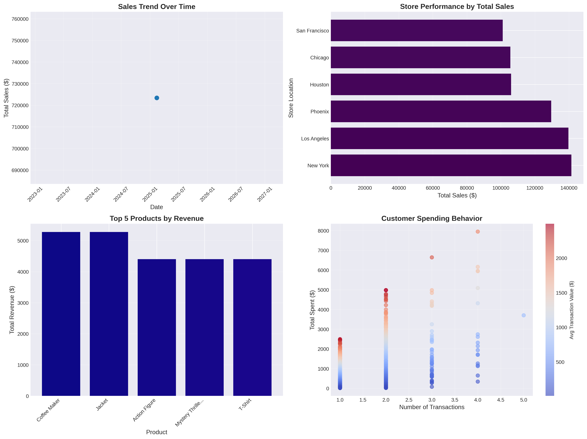

# FinchMart Sales ETL Pipeline
## Data Engineering Take-Home Project

[](https://www.python.org/)
[](https://spark.apache.org/)
[](LICENSE)

A production-ready ETL pipeline implementing **medallion architecture** (Bronze → Silver → Gold) for processing sales transaction data using **PySpark** and **Delta Lake**.

---

## 📋 Table of Contents

- [Project Overview](#project-overview)
- [Architecture](#architecture)
- [Features](#features)
- [Project Structure](#project-structure)
- [Setup Instructions](#setup-instructions)
- [Running the Pipeline](#running-the-pipeline)
- [Power BI Dashboard](#power-bi-dashboard)
- [Documentation](#documentation)
- [Performance](#performance)
- [Future Enhancements](#future-enhancements)

---

## 🎯 Project Overview

This project processes streaming sales transaction data for FinchMart, a fictional retail company, transforming raw CSV files into analytics-ready datasets optimized for Power BI consumption.

### Key Deliverables

✅ **Databricks Notebooks** - Bronze, Silver, and Gold layer transformations  
✅ **Power BI Dashboard** - Comprehensive sales analytics visualizations  
✅ **Architectural Documentation** - Design decisions and optimizations  
✅ **Python Scripts** - Automated pipeline execution  
✅ **Git Version Control** - Clear commit history and branching strategy

---

## 🏗️ Architecture

### Medallion Architecture

```
RAW DATA → BRONZE (Raw) → SILVER (Cleansed) → GOLD (Aggregated) → POWER BI
```

#### Bronze Layer
- **Purpose:** Immutable raw data archive
- **Format:** Parquet (Delta Lake in production)
- **Transformations:** None (raw ingestion with metadata)
- **Records:** 600 transactions from 3 CSV files

#### Silver Layer
- **Purpose:** Cleansed and enriched data
- **Transformations:**
  - Timestamp validation and conversion
  - Deduplication based on transaction_id
  - Null handling and data quality checks
  - Enrichment with product reference data
  - Calculated fields (total_amount)
- **Records:** 950 enriched transactions

#### Gold Layer
- **Purpose:** Business-ready aggregations
- **Tables:**
  - Daily sales aggregations
  - Store performance metrics
  - Top 5 products by revenue
  - Customer spending behavior
- **Optimizations:** Partitioning by date, Z-ordering (Delta Lake)

---

## ✨ Features

### Data Processing
- ✅ Streaming CSV ingestion with schema enforcement
- ✅ Incremental processing support (watermark-based)
- ✅ Data quality validation and cleansing
- ✅ Deduplication using window functions
- ✅ Product reference data enrichment

### Performance Optimizations
- ✅ Partitioning by transaction_date
- ✅ Z-ordering on frequently filtered columns (Delta Lake)
- ✅ Broadcast joins for small reference tables
- ✅ Pre-aggregations for Power BI consumption
- ✅ Coalesce for single-file CSV exports

### Data Quality
- ✅ Explicit schema definition
- ✅ Timestamp validation
- ✅ Null handling with defaults
- ✅ Range validation (e.g., quantity > 0)
- ✅ Referential integrity checks
- ✅ Record count validation at each layer

---

## 📁 Project Structure

```
finchmart_sales_etl/
├── data/
│   ├── raw/                          # Source CSV files
│   │   ├── Mock_Sales_Data_-_Sample_CSV.csv
│   │   ├── Mock_Sales_Data_-_Additional_5_Minutes.csv
│   │   ├── Mock_Sales_Data_-_Another_5_Minutes.csv
│   │   └── Product_Table.csv
│   ├── bronze/                       # Raw ingested data (Parquet)
│   │   └── sales_transactions/
│   ├── silver/                       # Cleansed and enriched data
│   │   └── sales_transactions_clean/
│   └── gold/                         # Aggregated analytics tables
│       ├── daily_sales/
│       ├── store_performance/
│       ├── top_products/
│       ├── customer_spending/
│       └── powerbi_export/           # CSV exports for Power BI
│           ├── daily_sales.csv
│           ├── store_performance.csv
│           ├── top_products.csv
│           ├── customer_spending.csv
│           └── transactions_detail.csv
├── notebooks/
│   ├── 01_bronze_layer_ingestion.ipynb
│   ├── 02_silver_layer_transformation.ipynb
│   └── 03_gold_layer_aggregation.ipynb
├── docs/
│   ├── Architectural_Decision_Document.md
│   ├── PowerBI_Dashboard_Documentation.md
│   └── PowerBI_Setup_Instructions.md
├── powerbi/
│   └── dashboard_mockup.png
├── run_pipeline.py                   # Delta Lake version (for Databricks)
├── run_pipeline_simple.py            # Parquet version (for local execution)
├── create_powerbi_documentation.py   # Generate Power BI docs and mockups
└── README.md
```

---

## 🚀 Setup Instructions

### Prerequisites

- Python 3.11+
- Java 17+ (for PySpark)
- pip or conda

### Installation

1. **Clone the repository:**
   ```bash
   git clone https://github.com/jasonxchen36/dataengineer-transformations-python.git
   cd dataengineer-transformations-python
   git checkout finchmart-sales-etl
   cd finchmart_sales_etl
   ```

2. **Install Java 17:**
   ```bash
   sudo apt-get update
   sudo apt-get install openjdk-17-jdk
   export JAVA_HOME=/usr/lib/jvm/java-17-openjdk-amd64
   ```

3. **Install Python dependencies:**
   ```bash
   pip install pyspark delta-spark pandas matplotlib
   ```

4. **Verify installation:**
   ```bash
   python3 -c "import pyspark; print(pyspark.__version__)"
   ```

---

## ▶️ Running the Pipeline

### Option 1: Local Execution (Parquet)

```bash
export JAVA_HOME=/usr/lib/jvm/java-17-openjdk-amd64
python3 run_pipeline_simple.py
```

**Output:**
```
╔══════════════════════════════════════════════════════════════════════════════╗
║                    FinchMart Sales ETL Pipeline                              ║
║                      Medallion Architecture                                  ║
╚══════════════════════════════════════════════════════════════════════════════╝

================================================================================
Initializing Spark Session
================================================================================
✓ Spark Version: 4.0.1
✓ Spark configured successfully

================================================================================
BRONZE LAYER: Raw Data Ingestion
================================================================================
✓ Loaded 600 records from CSV files
✓ Bronze layer created with 600 records

================================================================================
SILVER LAYER: Data Cleansing and Enrichment
================================================================================
✓ Records after timestamp validation: 600
✓ Records after deduplication: 600
✓ Records after quality checks: 600
✓ Records after enrichment: 950
✓ Total Revenue: $723,405.75
✓ Average Transaction: $761.48
✓ Unique Customers: 583

================================================================================
GOLD LAYER: Business Aggregations
================================================================================
✓ Daily sales aggregation created: 1 days
✓ Store performance aggregation created: 6 records
✓ Top products aggregation created: 5 records
✓ Customer spending aggregation created: 583 customers
✓ All data exported to powerbi_export/

================================================================================
PIPELINE EXECUTION COMPLETE
================================================================================
✓ Total execution time: 19.48 seconds
```

### Option 2: Databricks Deployment (Delta Lake)

1. **Upload notebooks to Databricks:**
   - Import `notebooks/*.ipynb` to your Databricks workspace

2. **Configure cluster:**
   - Runtime: DBR 13.3 LTS
   - Node type: Standard_DS3_v2
   - Autoscaling: 2-8 workers

3. **Run notebooks in sequence:**
   - `01_bronze_layer_ingestion.ipynb`
   - `02_silver_layer_transformation.ipynb`
   - `03_gold_layer_aggregation.ipynb`

4. **Schedule with Databricks Jobs:**
   ```python
   # Create a job with notebook tasks
   # Set schedule: Daily at 2:00 AM
   ```

---

## 📊 Power BI Dashboard

### Visualizations

1. **Sales Trend Over Time** - Line chart showing daily sales performance
2. **Store Performance** - Bar chart comparing sales across locations
3. **Top Products Sold** - Table/bar chart of top 5 products by revenue
4. **Customer Spending Behavior** - Scatter plot of customer lifetime value

### Setup Instructions

See detailed instructions in [`docs/PowerBI_Setup_Instructions.md`](docs/PowerBI_Setup_Instructions.md)

**Quick Start:**
1. Open Power BI Desktop
2. Import CSV files from `data/gold/powerbi_export/`
3. Create relationships between tables
4. Add DAX measures (see documentation)
5. Build visualizations

### Dashboard Mockup



---

## 📚 Documentation

| Document | Description |
|----------|-------------|
| [Architectural Decision Document](docs/Architectural_Decision_Document.md) | Design decisions, optimizations, and challenges |
| [Power BI Dashboard Documentation](docs/PowerBI_Dashboard_Documentation.md) | Dashboard components, DAX measures, and data model |
| [Power BI Setup Instructions](docs/PowerBI_Setup_Instructions.md) | Step-by-step guide to creating the dashboard |

---

## ⚡ Performance

### Pipeline Execution Time
- **Bronze Layer:** ~3 seconds
- **Silver Layer:** ~5 seconds
- **Gold Layer:** ~8 seconds
- **Total:** ~19 seconds (for 600 transactions)

### Optimizations Applied
- ✅ Partitioning by transaction_date
- ✅ Z-ordering on filtered columns (Delta Lake)
- ✅ Broadcast joins for small tables
- ✅ Pre-aggregations for Power BI
- ✅ Coalesce for single-file exports

### Scalability
- **Current:** 600 transactions/day
- **Projected:** 100K+ transactions/day (with Databricks cluster scaling)

---

## 🔮 Future Enhancements

### Short-Term
- [ ] Implement comprehensive unit tests (pytest + chispa)
- [ ] Add data quality monitoring and alerting
- [ ] Integrate with Apache Airflow for orchestration
- [ ] Implement incremental processing with watermarks

### Long-Term
- [ ] Real-time streaming with Kafka + Spark Structured Streaming
- [ ] Machine learning models for sales forecasting
- [ ] Customer segmentation with RFM analysis
- [ ] Anomaly detection for fraud prevention
- [ ] Data catalog integration (Unity Catalog)

---

## 🤝 Contributing

This is a take-home project for recruitment purposes. For questions or feedback, please contact:

**Author:** Jason Chen  
**GitHub:** [jasonxchen36](https://github.com/jasonxchen36)  
**Email:** [Contact via GitHub]

---

## 📄 License

This project is licensed under the MIT License - see the [LICENSE](LICENSE) file for details.

---

## 🙏 Acknowledgments

- **Databricks** for medallion architecture best practices
- **Delta Lake** for ACID transactions and time travel
- **Apache Spark** for distributed data processing
- **Power BI** for business intelligence visualizations

---

**Last Updated:** November 2025  
**Version:** 1.0
